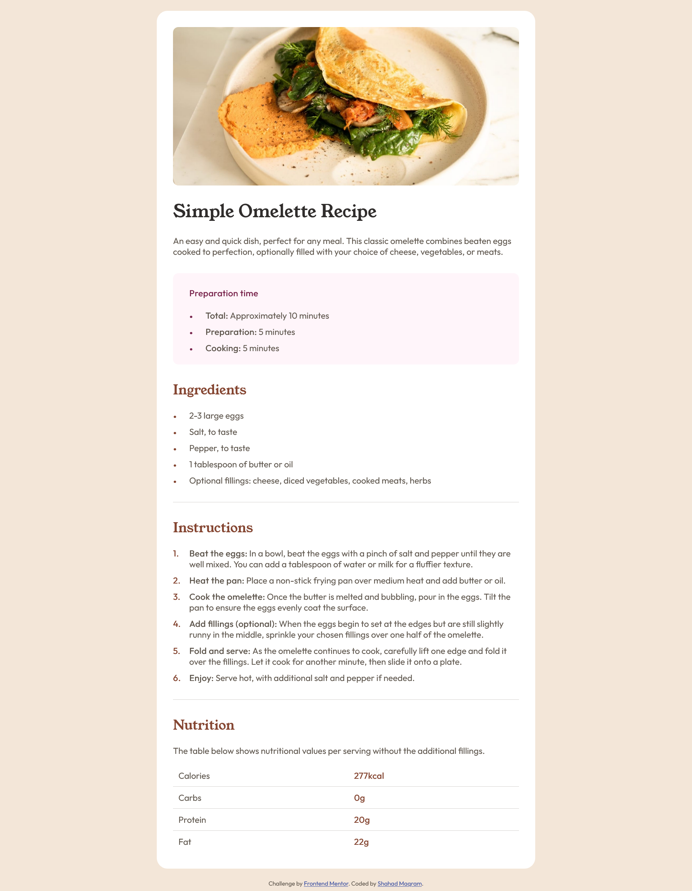
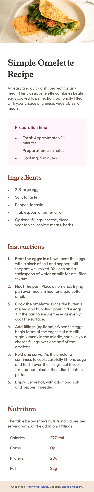

# Frontend Mentor - Recipe page solution

This is a solution to the [Recipe page challenge on Frontend Mentor](https://www.frontendmentor.io/challenges/recipe-page-KiTsR8QQKm). Frontend Mentor challenges help you improve your coding skills by building realistic projects. 

## Table of contents

- [Overview](#overview)
  - [The challenge](#the-challenge)
  - [Screenshot](#screenshot)
  - [Links](#links)
- [My process](#my-process)
  - [Built with](#built-with)
  - [What I learned](#what-i-learned)
  - [Continued development](#continued-development)
  - [Useful resources](#useful-resources)
- [Author](#author)
- [Acknowledgments](#acknowledgments)


## Overview

### Screenshot





### Links

- Solution URL: [https://github.com/shahadm11/Recipe-page-main]
- Live Site URL: [https://shahadm11.github.io/Recipe-page-main/]

## My process

### Built with

- Semantic HTML5
- CSS custom properties (variables)
- Mobile-first workflow
- Responsive design with media queries
- Custom list markers using pseudo-elements
- External CSS stylesheet
- Google Fonts (Outfit & Young Serif)

### What I learned

In this project, I focused on writing clean and semantic HTML while keeping the CSS organized and reusable.

Some key things I practiced and learned:

- Using semantic elements like `<main>` and `<section>` for better structure
- Styling ordered and unordered lists with custom markers using `::before`
- Keeping text alignment consistent when list items wrap into multiple lines
- Creating responsive layouts without fixed widths that cause horizontal scrolling
- Separating CSS into an external stylesheet for better maintainability

Example of custom list styling:

```css
li {
  padding-left: 30px;
  position: relative;
  margin-bottom: 10px;
}

li::before {
  position: absolute;
  top: 0;
  left: 0;
  font-weight: 700;
  color: var(--titles-color);
}
```


## Useful resources

- [Frontend Mentor](https://www.frontendmentor.io) - Practice challenges and design files.


## Author

- Frontend Mentor - [@shahadm11](https://www.frontendmentor.io/profile/shahadm11)
